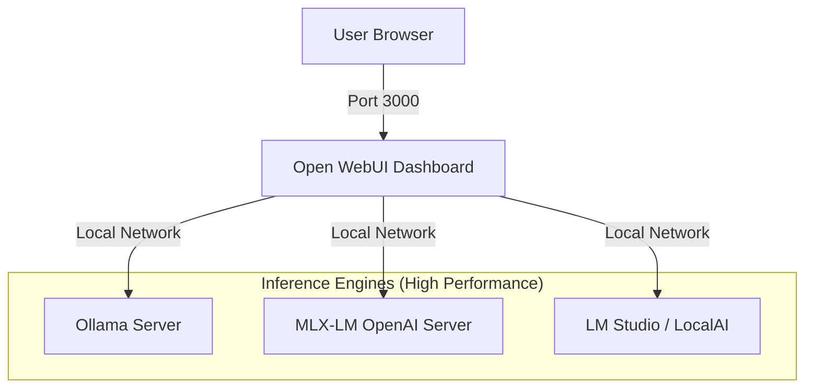

# Local AI Control Center: Architectural Blueprint

This document outlines the strategy for unifying the local AI playground into a single, manageable dashboard.

## Vision
To transition from a "messy" collection of isolated servers and scripts to a unified **Local AI Control Center** that manages chats, agents, and RAG (Retrieval Augmented Generation) across all local backends.

## Proposed Strategy: Open WebUI Hub

### 1. Unified interface
We will use **Open WebUI** as the primary orchestration layer. It is chosen for its native ability to:
- Connect to **Ollama** via its local API.
- Connect to **MLX** and **LM Studio** via OpenAI-compatible endpoints.
- Manage "Model Files" (pre-configured system prompts and tools) as persistent agents.

### 2. Physical Architecture
- **Dashboard Layer**: Containerized (Docker) for consistent state management and easy updates.
- **Inference Layer**: Native (Native Mac/MLX/Ollama) for maximum performance on Apple Silicon.
- **Orchestration**: A root-level `docker-compose.yml` will manage the dashboard and its internal database (vector storage, chat history).

## Connectivity Map

## Agent Management
Rather than scattered `.py` scripts, agents will be managed as:
- **WebUI Functions**: For complex, multi-tool interactions.
- **Model Files**: For specialized personalities and prompt-engineering.
- **External Scripts**: Using the `smolagents` playground for research-level autonomy.

## Configuration (.env)
A centralized environment file will govern all discovery:
- `OLLAMA_BASE_URL`
- `OPENAI_API_BASE_URL` (Pointing to MLX/LM Studio)
- `LOCALAI_BASE_URL`

---
*Status: Planning Phase*
