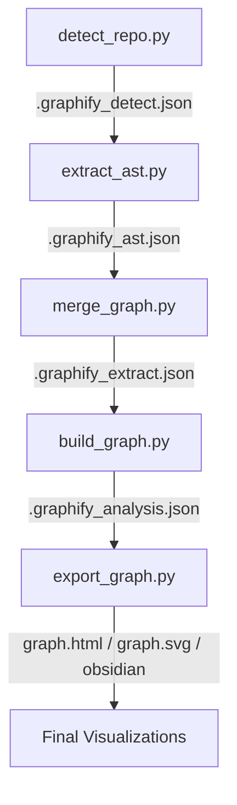

# Graphify Simulation Guide: No-Agent Workflow

This guide explains how to run the full Graphify pipeline locally using the provided utility scripts, without needing an active AI coding assistant or agent.

## 🏗 Workflow Architecture

The simulation pipeline consists of five distinct steps that mirror the internal logic of the Graphify AI Skill.



---

## 🚀 Step-by-Step Execution

### 1. Detection
Analyze the target directory to identify supported code, documents, and media.
```bash
python detect_repo.py ./example
```
*Outputs: `graphify-out/.graphify_detect.json`*

### 2. AST Extraction
Perform deterministic static analysis on code files to build the structural skeleton of the graph (classes, functions, imports).
```bash
python extract_ast.py
```
*Outputs: `graphify-out/.graphify_ast.json`*

### 3. Merge Results
Combine the AST data with any semantic extraction data. (Note: In this simulation, semantic data is typically empty unless you provide a `.graphify_semantic.json` manually).
```bash
python merge_graph.py
```
*Outputs: `graphify-out/.graphify_extract.json`*

### 4. Build & Analyze
This is the "Engine" step. It builds the NetworkX graph, runs the **Leiden algorithm** for community detection, and generates the audit report.
```bash
python build_graph.py
```
*Outputs: `graphify-out/graph.json` and `graphify-out/GRAPH_REPORT.md`*

### 5. Export Visualizations
Generate interactive or static views of the resulting knowledge graph.

**Interactive HTML (Browser):**
```bash
python export_graph.py --format html
```

**Obsidian Vault (Canvas):**
```bash
python export_graph.py --format obsidian
```

**Neo4j (Database):**
```bash
# 1. Setup environment
cp .env.example .env

# 2. Start Neo4j in Docker
docker-compose up -d

# 2. Export the Cypher script
python export_graph.py --format cypher

# 4. Import to Neo4j (using cypher-shell)
# Replace 'neo4j' and 'password' with values from your .env if changed
docker exec -it graphify-neo4j cypher-shell -u neo4j -p password -f /graphify_context/graphify-out/cypher.txt
```
*Access the Neo4j Browser UI at: http://localhost:7474 (user: neo4j, pass: password)*

---

## 📊 Understanding the Outputs

- **`graphify-out/graph.html`**: Open this in any browser to explore the 3D interactive graph. Nodes are colored by community.
- **`graphify-out/GRAPH_REPORT.md`**: Read this for a human-readable summary of "God Nodes" (the hub components of your system) and "Surprises" (unexpected bridge connections).
- **`graphify-out/obsidian/`**: Open this folder as a vault in Obsidian to see a graph where every node is a note, and the architecture is visible via the Obsidian Graph View and Canvas.

---

## 💡 Troubleshooting

- **Permission Denied**: If running `./script.py` fails, use `python script.py`.
- **Missing Files**: Ensure you run the steps in order. Each script depends on the output of the previous one.
- **Empty Graph**: If your target directory has no supported files, detection will fail. Check your file extensions (.py, .js, .md, etc.).
