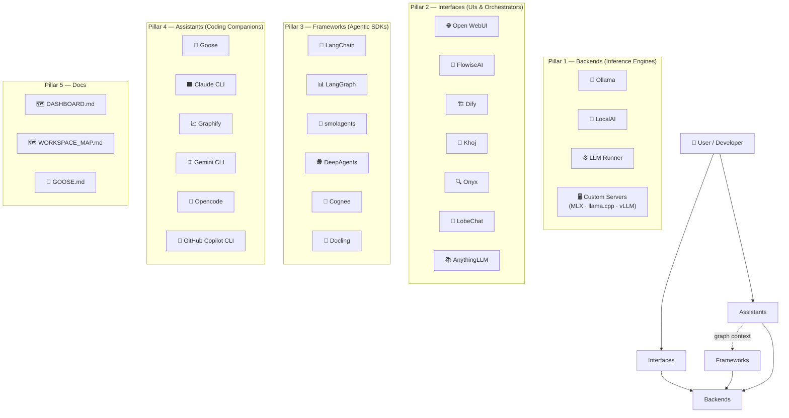

# 🗺️ Workspace Map — Local AI Playground

> **Last updated:** 2026-04-21  
> Auto-generated by Antigravity from live directory analysis.

This document provides a comprehensive structural map of the `local_ai_playground` repository, describing every component, its purpose, and how the five pillars connect.

---

## 📐 High-Level Architecture



---

## 📂 Full Directory Tree

```
local_ai_playground/
├── README.md                  # Landing page & quick start
├── STRUCTURE.md               # Structural overview (this repo)
├── CHANGELOG.md               # Full change history
├── LICENSE.md                 # Apache 2.0
│
├── backends/                  # Inference engines & model servers
│   ├── README.md
│   ├── ollama/                # Ollama config & usage guides
│   ├── localai/               # LocalAI API emulation
│   ├── llm_runner/            # High-performance inference orchestration
│   └── custom_servers/        # Apple Silicon servers (MLX, llama.cpp, vLLM)
│       ├── debug/
│       ├── llama-cpp-server/
│       ├── lm-studio-server/
│       ├── mlx-lm-server/
│       ├── mlx-openai-server/
│       ├── ollama-server/
│       └── vllm-mlx/
│
├── interfaces/                # Dashboards, chat UIs, orchestration platforms
│   ├── README.md
│   ├── open_webui/            # Primary daily-driver chat interface
│   ├── flowise/               # Visual node-based agent orchestration (Winner)
│   ├── dify/                  # GenAI app deployment platform
│   ├── khoj/                  # Personal AI aggregator / second-brain
│   ├── onyx/                  # Enterprise search & RAG (50+ data sources)
│   ├── lobe_chat/             # Premium chat client with agent personas
│   └── anything_llm/          # Workspace-based document RAG
│
├── frameworks/                # Agentic SDKs & libraries
│   ├── README.md
│   ├── langchain/             # LangChain with MLX, llama.cpp, Ollama, RAG
│   ├── langgraph/             # Stateful multi-actor graphs (built on LangChain)
│   ├── smolagents/            # HuggingFace smolagents (multi-backend)
│   ├── deepagents/            # Autonomous long-running agents (built on LangGraph)
│   ├── cognee/                # Semantic memory & knowledge graphs
│   └── docling/               # Document conversion (PDF/DOCX → Markdown/JSON)
│
├── assistants/                # AI coding companions & specialized tools
│   ├── README.md
│   ├── goose/                 # Goose open-source AI agent
│   ├── claude/
│   │   ├── claude-cli/        # Claude CLI skills & plugins
│   │   └── claude-lm-studio/  # Claude connected to local LM Studio
│   ├── graphify/              # Codebase knowledge graph indexing tool
│   ├── gemini-cli/            # Gemini CLI integration (🚧 In Progress)
│   ├── opencode/              # Opencode AI coding assistant (🚧 In Progress)
│   └── github-copilot-cli/    # GitHub Copilot CLI (🚧 In Progress)
│
└── docs/                      # Ecosystem documentation & blueprints
    ├── DASHBOARD.md           # Unified Local AI Control Center blueprint
    ├── WORKSPACE_MAP.md       # This file — full structural map
    └── GOOSE.md               # Goose assistant quick-start guide
```

---

## 🗂️ Component Status Table

### Backends

| Component | Type | Status | Key Files |
|---|---|---|---|
| **Ollama** | Inference engine | ✅ Active | `src/`, `README.md` |
| **LocalAI** | API emulation | ✅ Active | `localai_example.py` |
| **LLM Runner** | Perf. orchestration | ✅ Active | `examples/`, `requirements.txt` |
| **Custom Servers** | Apple Silicon (MLX/vLLM) | ✅ Active | 7 sub-servers |

### Interfaces

| Component | Type | Status | Verdict |
|---|---|---|---|
| **Open WebUI** | Chat UI | ✅ Daily Driver | Best Ollama-native interface |
| **FlowiseAI** | Visual orchestration | ✅ Primary | Winner for node-based agent chains |
| **Dify** | App platform | ✅ Secondary | Best-in-class RAG citations |
| **Khoj** | Second Brain | ✅ Active | Solves "Manual Ingestion Syndrome" |
| **Onyx** | Enterprise search | 📂 Evaluated | Best for massive fragmented datasets |
| **LobeChat** | Premium chat | ✅ Evaluated | Good UX, no complex orchestration |
| **AnythingLLM** | Document RAG | 📂 Evaluated | Replaced by Khoj for RAG |

### Frameworks

| Component | Type | Status | Key Example |
|---|---|---|---|
| **LangChain** | SDK | ✅ Active | `ollama_rag_chat_example.py` |
| **LangGraph** | Stateful graphs | ✅ Active | `ollama_example.py` |
| **smolagents** | Lightweight agents | ✅ Active | `ollama_rag_example.py` |
| **DeepAgents** | Autonomous agents | ✅ Active | `ollama_example.py` |
| **Cognee** | Semantic memory | ✅ Active | `ollama_memory_example.py` |
| **Docling** | Doc conversion | ✅ Active | `convert_document_example.py` |

### Assistants

| Component | Type | Status | Notes |
|---|---|---|---|
| **Goose** | AI agent | ✅ Active | Open-source dev assistant |
| **Claude CLI** | CLI + LM Studio | ✅ Active | Anthropic Claude skills & local routing |
| **Graphify** | Code graph tool | ✅ Active | AST-based codebase knowledge graphs |
| **Gemini CLI** | CLI assistant | 🚧 In Progress | Setup pending |
| **Opencode** | AI coding tool | 🚧 In Progress | Setup pending |
| **GitHub Copilot CLI** | CLI assistant | 🚧 In Progress | Setup pending |

---

## 🔗 Data Flow

```
[ User Prompt ]
      │
      ▼
[ Assistant / Interface ]  ──────────►  [ Framework SDK ]
  (Goose, Claude CLI,                    (LangChain, LangGraph,
   Open WebUI, Dify)                      smolagents, Cognee)
      │                                        │
      ▼                                        ▼
[ Backend / Inference Engine ]  ◄──────────────┘
  (Ollama, LocalAI, MLX, llama.cpp)
      │
      ▼
[ LLM Response ]  ──►  [ Memory / Graph ]  (Cognee, Graphify, FAISS)
```

---

## 🗓️ Update History

| Date | Event |
|---|---|
| 2026-04-21 | Created this `WORKSPACE_MAP.md` via full repo analysis |
| 2026-04-17 | Added Graphify to `assistants/` |
| 2026-04-16 | Added Khoj to `interfaces/` |
| 2026-04-12 | Added LangGraph, DeepAgents, Docling, Cognee, Onyx |
| 2026-04-10 | Refactored structure — created `docs/` directory |
| 2026-04-08 | Initialized smolagents + LocalAI |
| 2024-10-05 | Initial release |
